## regex_seq
`R: x y z`
       Test sequencing of terminals in a grammar.

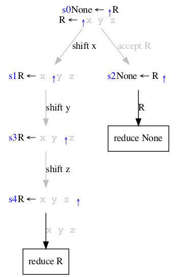

## regex_seqstar
`R: x* y* z*`
       Test repetition of terminals within a sequence.

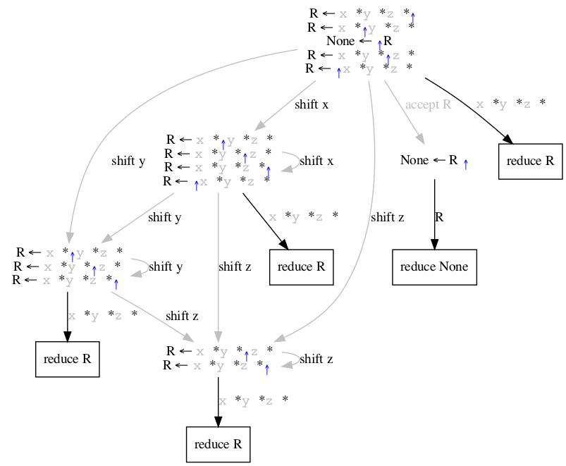

## regex_starboundedleft
`R: l x*`
       Test repetition of a terminal with a non-overlapping boundary on the left.

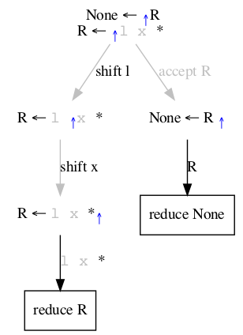

## regex_starboundedleft2
`R: x x*`
       Test repetition of a terminal with an overlapping boundary on the left.

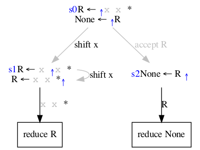

## regex_starboundedright
`R: x* r`
       Test repetition of a terminal with a non-overlapping boundary on the right.

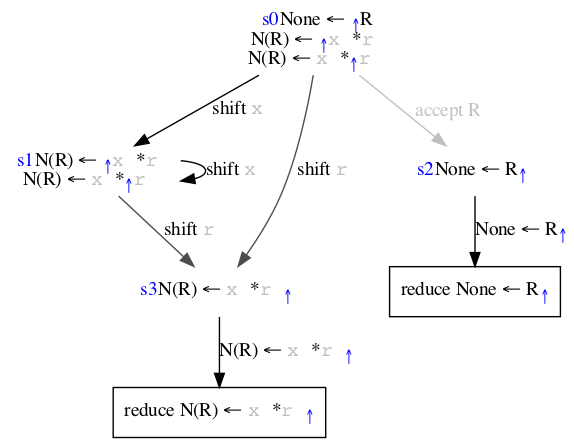

## regex_starboundedright2
`R: x* x`
       Test repetition of a terminal with an overlapping boundary on the right.

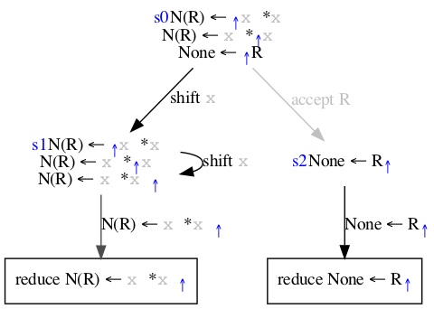

## regex_starboundedboth
`R: l x* r`
       Test repetition of a terminal with a non-overlapping boundary on both sides.

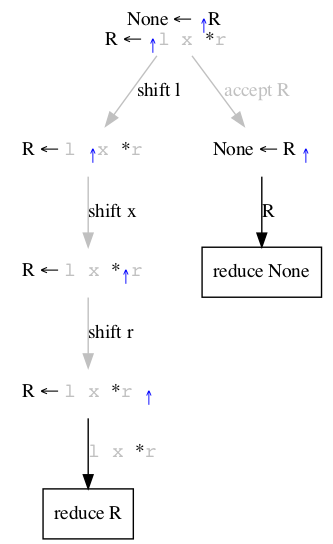

## regex_starboundedboth2
`R: x x*`
       Test repetition of a terminal with an overlapping boundary on both sides.

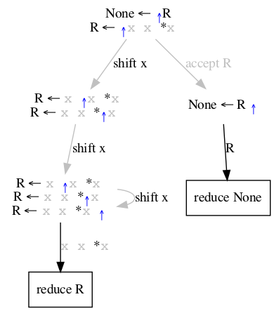

## regex_choice
`R: (x|y) (y|z) (z|k)`
       Test sequence of choices with overlapping cases.

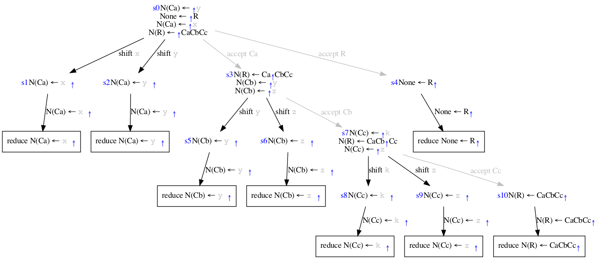

## regex_choicestar
`R: (x|y) (y|z) (z|k)`
       Test sequence of repeated choices with overlapping cases.

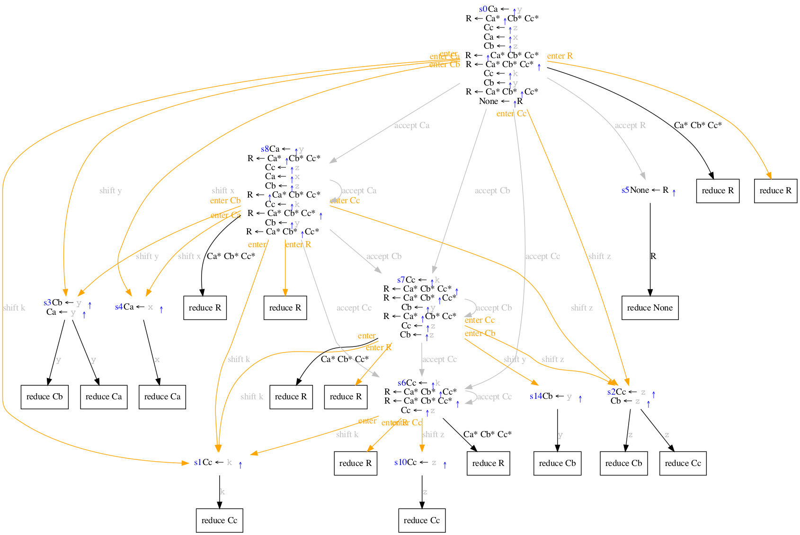

## regex_selfalignunbounded
`R: (x y)*`
       Test self aligned repeating sequence with no boundaries.

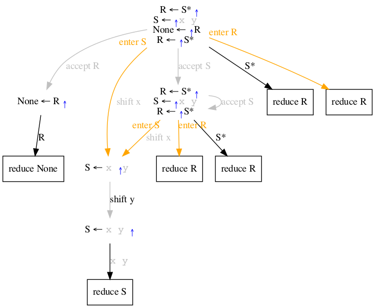

## regex_selfalignboundedleft
`R: l (x y)*`
       Test self aligned repeating sequence with a non-overlapping boundary on the left.

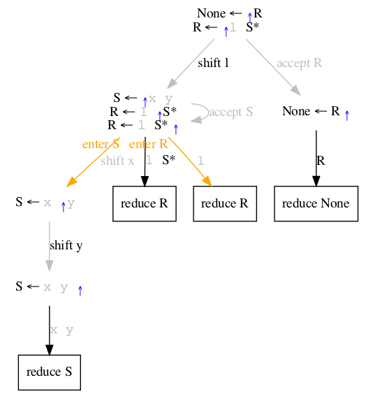

## regex_selfalignboundedleft2
`R: x (x y)*`
       Test self aligned repeating sequence with an overlapping boundary on the left.

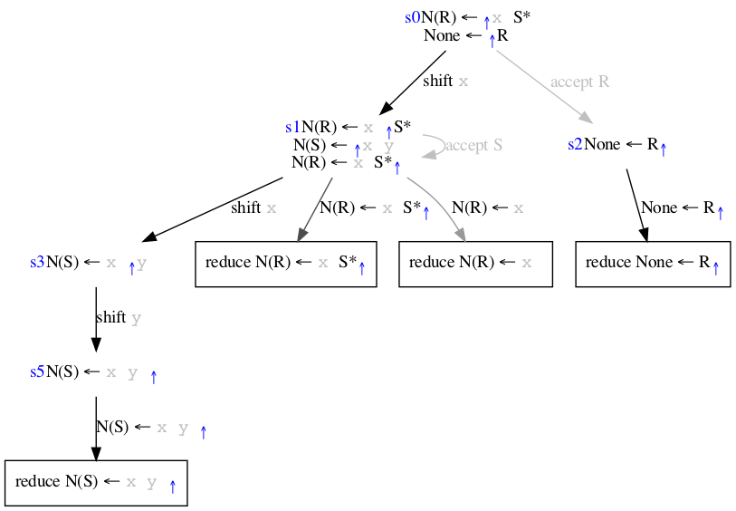

## regex_selfalignboundedright
`R: (x y)* r`
       Test self aligned repeating sequence with a non-overlapping boundary on the right.

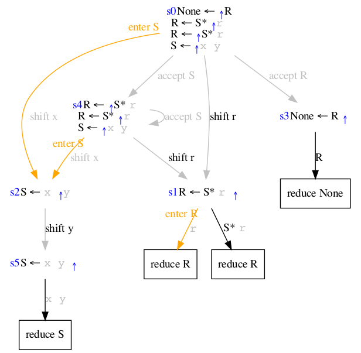

## regex_selfalignboundedright2
`R: (x y)* x`
       Test self aligned repeating sequence with an overlapping boundary on the right.

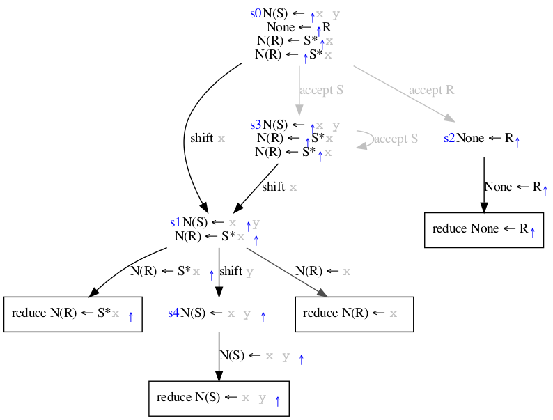

## regex_selfalignboundedboth
`R: l (x y)* r`
       Test self aligned repeating sequence with a non-overlapping boundary on both sides.

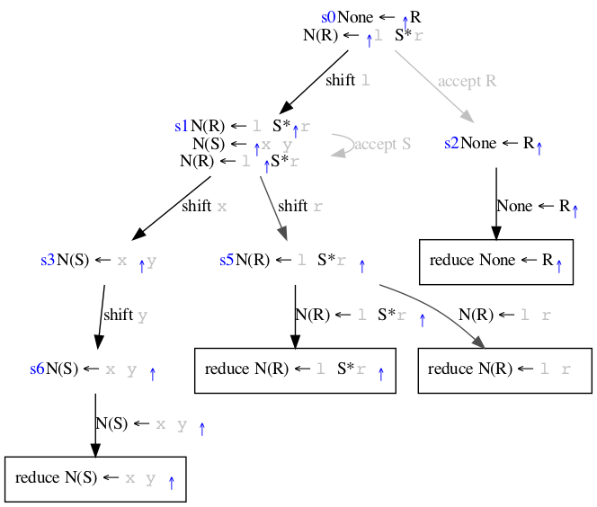

## regex_selfalignboundedboth2
`R: x (x y)* x`
       Test self aligned repeating sequence with an overlapping boundary on both sides.

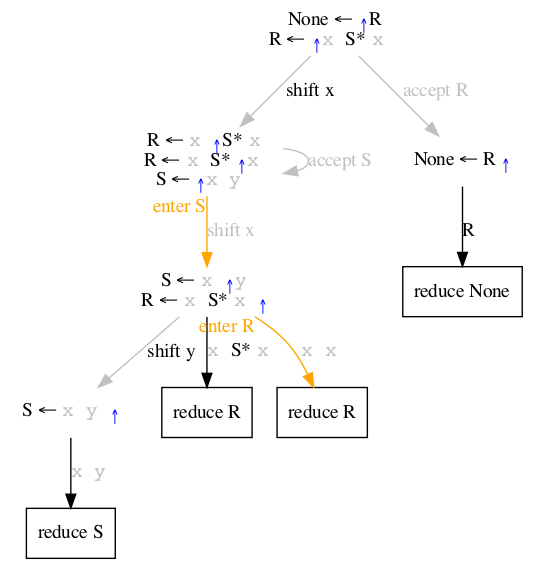
