## toy_numberlist
`Test lists of integer literals.`

## toy_stringlist
`atom: str_lit | order   order: [ elem_lst* ]   elem_lst: atom?   str_lit: ' [^"]* " | u( [^)]* )`
       Test lists of pidgin-style string literals.

## toy_stringlist2
`A: S | O   O: [ ] | [ P* A ,?] | [ A A+ ]   P: A ,   S: ' [^"]* " | u( [^)]* )`
       Test lists of pidgin-style string literals with uniform but optional commas.

## quoted_str
`Q: ' [^"]* " | u( [^)]* \)`
       Test inverted character sets and glue.

## quoted_str2
`Q: ' [^"]* " | << ([^>] | > [^>])* >>`
       Test inverted character sets and glue, matching a two-symbol terminator.

## quoted_str3
`Q: " ([^"] | \ [^] )* "`
       Test C-style strings with two-symbol escape sequences.

## quoted_str4
`L: I  | I ! L | Q    Q: ' [^"]* " | u( [^)]* \)    I: [a-z] Glue [a-z0-9]* Remover`
       Test pidgin-style strings in a language with a single binary operator.

## quoted_str5
`Binop: I ! Binop | Atom   Atom: I | Q    Q: ' [^"]* " | u( [^)]* \)    I: [a-z] Glue [a-z0-9]* Remover`
       Test pidgin-style strings in a language with a single binary operator. Differs to the previous
       case by splitting the ident and indent-plus-operator into separate rules to simulate a piece
       of the pidgin grammar.

## recurse_degenseq
`R: R* x`
       Test degenerate form of terminal repetition, same language as x+ but combinatorially ambiguous without
       greediness. Left-recursive form.

## recurse_degenseq2
`R: x R*`
       Test degenerate form of terminal repetition, same language as x+ but combinatorially ambiguous without
       greediness. Right-recursive form.

## recurse_degenseq3
`R: (R x)*`
       Test degenerate form of terminal repetition, same language as x* but combinatorially ambiguous without
       greediness. Left-recursive form. Successful traces have a prefix that reduces empty to R before starting
       to shift.

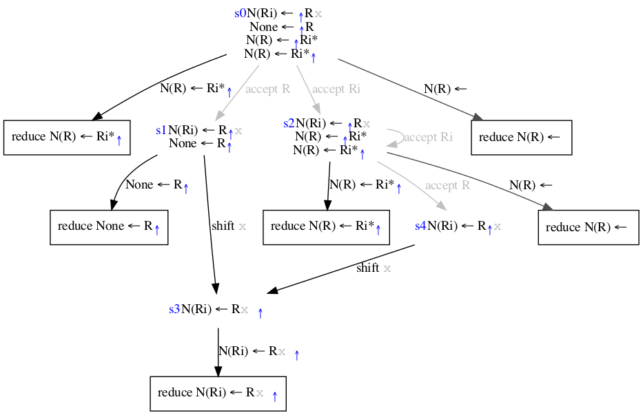

## recurse_degenseq4
`R: (x R)*`
       Test degenerate form of terminal repetition, same language as x* but combinatorially ambiguous without
       greediness. Right-recursive form.

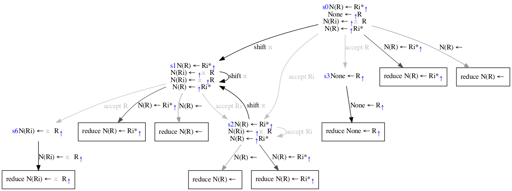

## recurse_nests
`R: l R* r`
       Test bracket nesting. Not degenerate as sub-sequences cannot overlap?

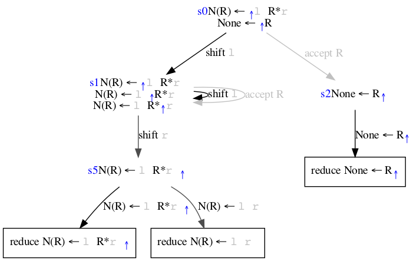

## recurse_nests2
`R: (l R r)*`
       Test bracket nesting. Not degenerate as sub-sequences cannot overlap?

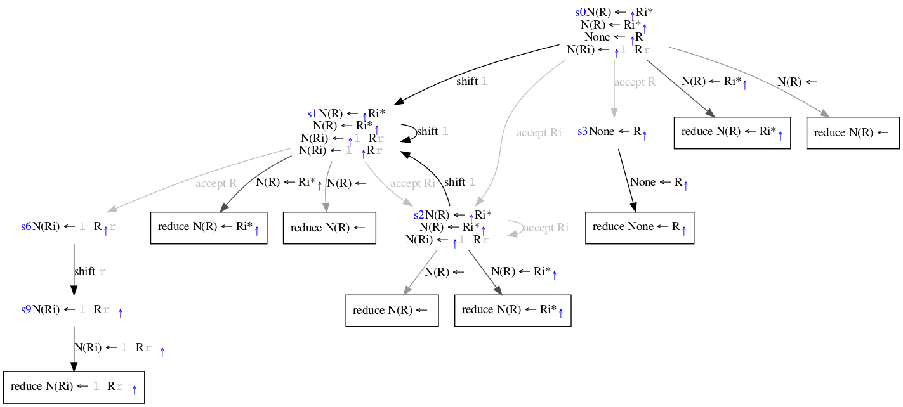

## recurse_parensseq
`E: (x | < E >)(+ E)*`
       Test a parenthesized sequence with a single operator.

## recurse_parensseq2
`E: F (/ F)* ; F: (x | < E >)(+ E)*`
       Test a parenthesized sequence with two prioritized operators.

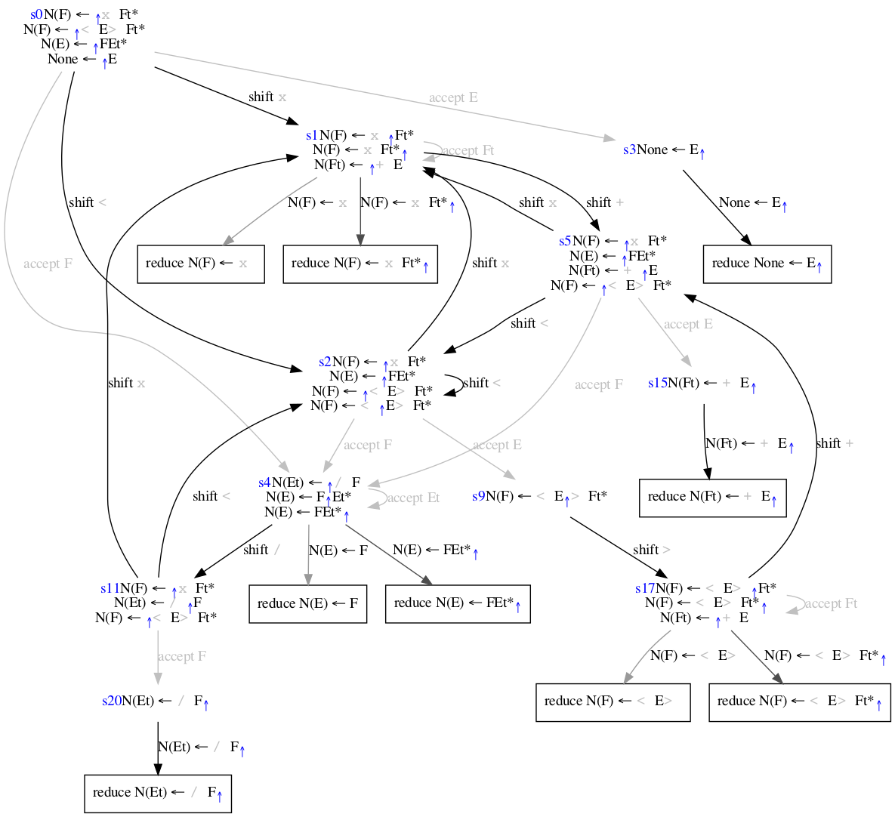

## recurse_partialnests
`R: l* R r*`
       Test bracket (partial-) nesting. Impossible to match as requires an infinitely deep
       nesting of R.

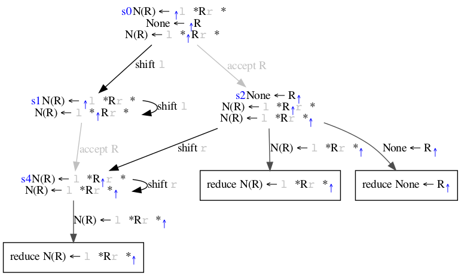

## recurse_termplusvianonterm
`R: S* x ; S: x`
       Test that non-terminal stars are equivalent to terminal stars, simulate x+ via depth-limited recursion.

## recurse_termplusvianonterm2
`R: S* l r ; S: l r`
       Test that non-terminal stars are equivalent to terminal stars, simulate (l r)+ via depth-limited recursion.

## regex_choice
`R: (x|y) (y|z) (z|k)`
       Test sequence of choices with overlapping cases.

## regex_choicestar
`R: (x|y)* (y|z)* (z|k)*`
       Test sequence of repeated choices with overlapping cases.

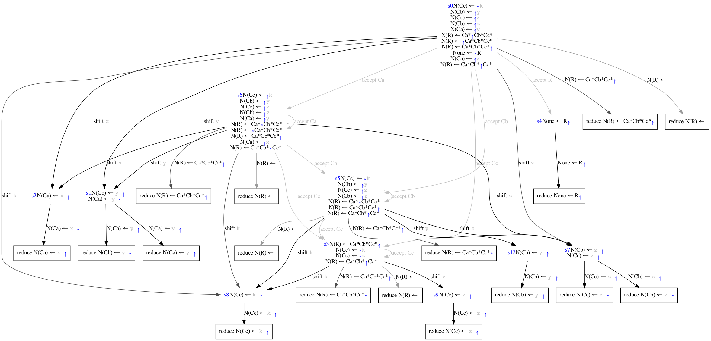

## regex_glue
`R: [a-z] Glue [a-z0-9]* Remover`
       Test use of glue between terminals.

## regex_glue2
`R: [a-z] Glue [a-z0-9]* Remover`
       Test use of glue between terminals.

## regex_selfalignboundedboth
`R: l (x y)* r`
       Test self aligned repeating sequence with a non-overlapping boundary on both sides.

## regex_selfalignboundedboth2
`R: x (x y)* x`
       Test self aligned repeating sequence with an overlapping boundary on both sides.

## regex_selfalignboundedleft
`R: l (x y)*`
       Test self aligned repeating sequence with a non-overlapping boundary on the left.

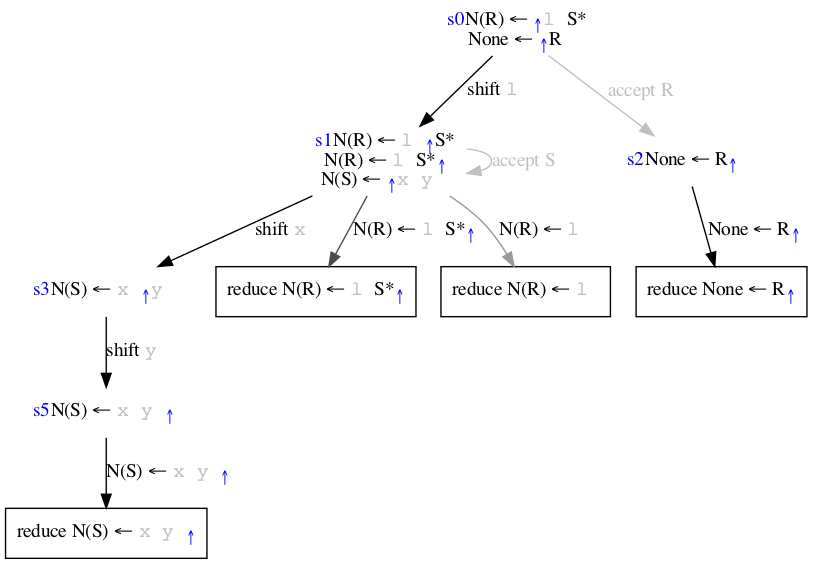

## regex_selfalignboundedleft2
`R: x (x y)*`
       Test self aligned repeating sequence with an overlapping boundary on the left.

## regex_selfalignboundedright
`R: (x y)* r`
       Test self aligned repeating sequence with a non-overlapping boundary on the right.

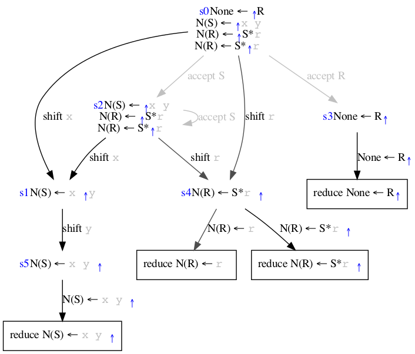

## regex_selfalignboundedright2
`R: (x y)* x`
       Test self aligned repeating sequence with an overlapping boundary on the right.

## regex_selfalignunbounded
`R: (x y)*`
       Test self aligned repeating sequence with no boundaries.

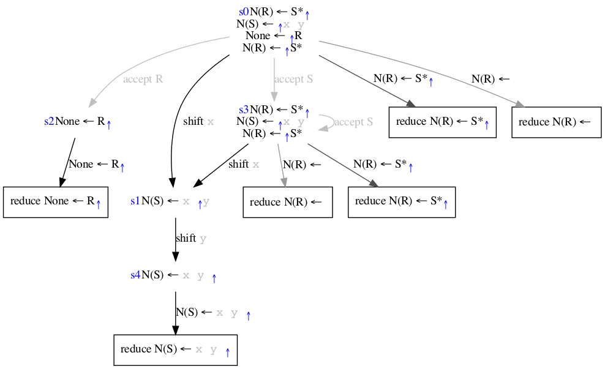

## regex_seq
`R: x y z`
       Test sequencing of terminals in a grammar.

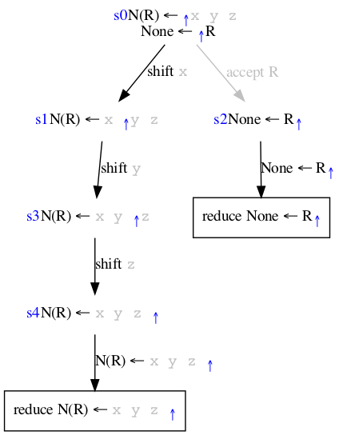

## regex_seqstar
`R: x* y* z*`
       Test repetition of terminals within a sequence.

## regex_starboundedboth
`R: l x* r`
       Test repetition of a terminal with a non-overlapping boundary on both sides.

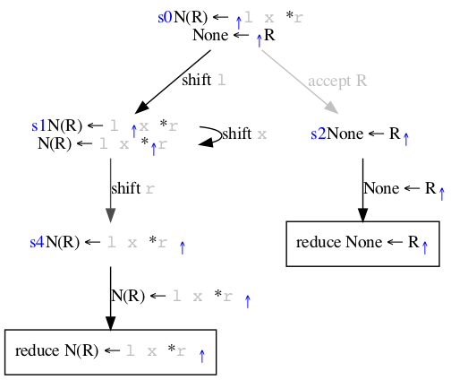

## regex_starboundedboth2
`R: x x* x`
       Test repetition of a terminal with an overlapping boundary on both sides.

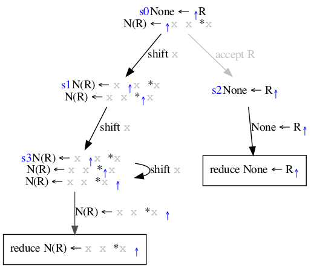

## regex_starboundedleft
`R: l x*`
       Test repetition of a terminal with a non-overlapping boundary on the left.

## regex_starboundedleft2
`R: x x*`
       Test repetition of a terminal with an overlapping boundary on the left.

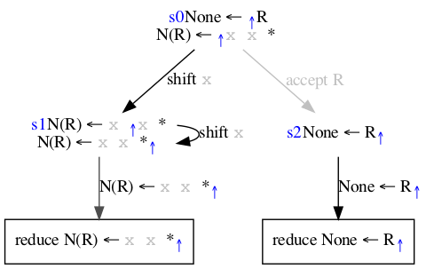

## regex_starboundedleft3
`R: x W ; W: x*`
       Test repetition of a terminal with an overlapping boundary on the left, where the repeating part is
       wrapped inside a non-terminal to test if the handle check consumes the extra symbol.

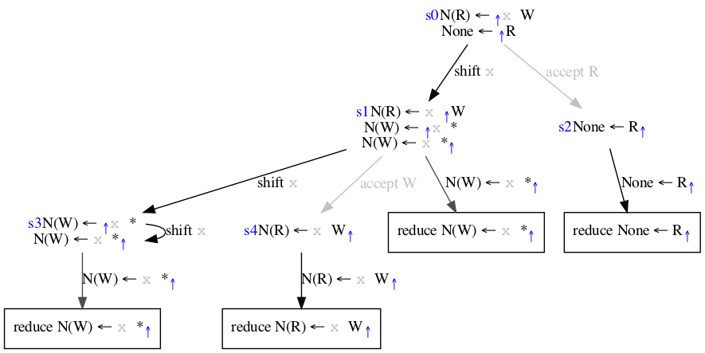

## regex_starboundedright
`R: x* r`
       Test repetition of a terminal with a non-overlapping boundary on the right.

## regex_starboundedright2
`R: x* x`
       Test repetition of a terminal with an overlapping boundary on the right, equivalent to x+

